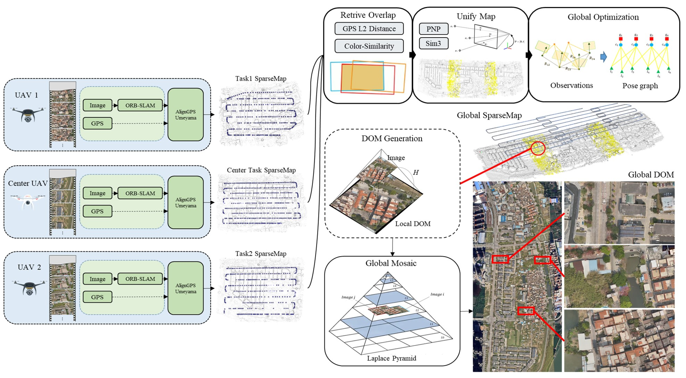
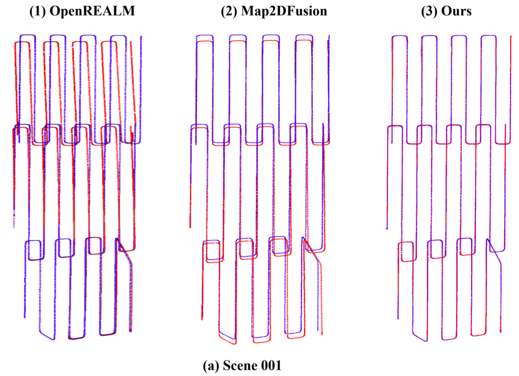

# DoMapping: Multi-UAV Real-Time DOM Mapping with Local-to-Global Optimization


## About
Multi-UAV Real-Time Orthophoto Fusion Mapping Framework

​	**Figure1.** Extensive experiments on multi-UAV datasets demonstrate that our approach achieves both local visual continuity and global spatial accuracy, establishing a practical framework for large-scale, real-time multi-UAV DOM mapping.



​	**Figure 2.** Trajectory comparison. Blue is ground truth trajectory, Red is estimated trajectory.


## Getting Started
### build docker
```bash
sh build_ubuntu2004_cuda_base.sh
```
### build external_library
```bash
mkdir external_library
cmake zlib, libpng, libjpeg, tiff, libgeotiff, proj, boost, gdal, etc.
```
external_library list see [external_library.cmake](./cmake/external_library.cmake)


### build thirdparty
```bash
cd thirdparty
cmake ..
make -j32 && make install
```

### build src
```bash
mkdir build && cd build
cmake ..
make -j32 && make install
```

## Run
run single task: 
for example `38ffff08-1401-4d3b-a9aa-48a64e565393`
```bash
# task initial
./bin/realtime2d_app_initial \
--task_json_file=/data/realtime2d_input/38ffff08-1401-4d3b-a9aa-48a64e565393.json \
--input_directory=/data/realtime2d_input/ \
--config_directory=/DoMapping/config/ \
--output_directory=/data/output/
# task start
./bin/realtime2d_app_start \
--task_json_file=/data/realtime2d_input/38ffff08-1401-4d3b-a9aa-48a64e565393.json \
--output_directory=/data/output/
# task stop
./bin/realtime2d_app_stop \
--task_json_file=/data/realtime2d_input/38ffff08-1401-4d3b-a9aa-48a64e565393.json \
--output_directory=/data/output/
```

run merge task: 
```bash
./bin/realtime2d_app_merge \
--voc_file=/DoMapping/config/Vocabulary/ORBvoc.bin \
--workspace_directory=/data/output/ \
--output_directory=/data/output/realtime2d_app_merge \
--task_filenames="38ffff08-1401-4d3b-a9aa-48a64e565393;a717aeb4-da8f-43f2-a26f-c28574883da1;b6f30280-411d-43a1-8d32-0d489d9fea9c" \
--use_global_optimization=0 \
--task_nums=3
```

## Datasets
### NPU DroneMap Dataset
https://github.com/npupilab/npu-dronemap-dataset

## Acknowledgement
If you use this project for your research, please cite
```
@inproceedings{,
    author={},
    title={DoMapping: Multi-UAV Real-Time DOM Mapping with Local-to-Global Optimization},
    booktitle={***},
    year={2025},
}
```

